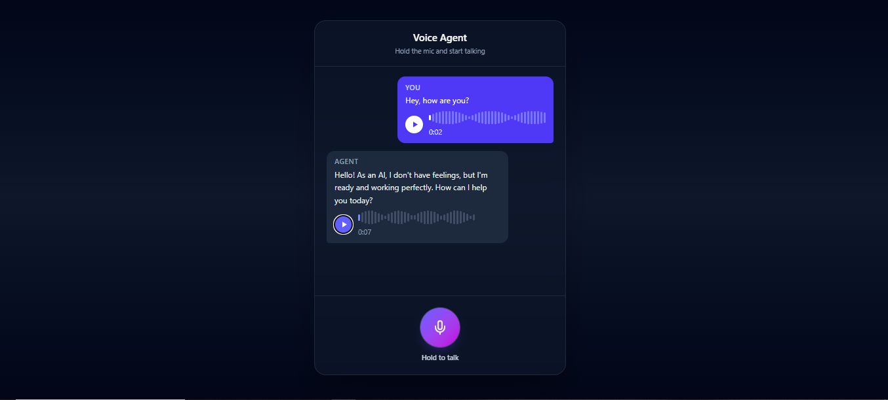

# 🎙️ Voice Assisted Chatbot

A full voice-in / voice-out AI assistant. Hold the mic, speak, and the agent
transcribes your speech, thinks up a reply, and **speaks it back** — all in a
clean, WhatsApp-style chat UI.

- **Speech-to-text** — [faster-whisper](https://github.com/SYSTRAN/faster-whisper) (local, with noise cleanup + VAD)
- **Reasoning** — Google **Gemini** (with conversation memory)
- **Text-to-speech** — Gemini TTS (spoken replies, auto-played)
- **Frontend** — React + Vite + Tailwind CSS v4
- **Backend** — FastAPI (Python)

---

## 📸 Demo

<p align="center">
  
</p>

---

## ✨ Features

- 🎤 **Push-to-talk** mic with a live waveform visualizer
- 📝 Real-time transcription via local Whisper (no audio leaves your machine for STT)
- 🤖 Context-aware replies from Gemini (remembers the conversation)
- 🔊 Natural spoken responses (Gemini TTS), auto-played in WhatsApp-style voice notes
- 🧹 Three-layer noise handling: browser suppression → high-pass + normalize → Whisper VAD
- 📱 Responsive dark UI with smooth state transitions and a "thinking" indicator

---

## 🏗️ Architecture

```
┌──────────────┐        /api/* (HTTP)        ┌───────────────────────────┐
│   Browser    │  ───────────────────────▶   │  FastAPI backend (:8000)  │
│ React + Vite │                             │                           │
│  (nginx in   │   transcribe → chat → tts   │  • /transcribe  Whisper   │
│  production) │  ◀───────────────────────   │  • /chat        Gemini    │
└──────────────┘                             │  • /tts         Gemini TTS│
                                             └───────────────────────────┘
```

In production, nginx serves the built frontend **and** reverse-proxies `/api`
to the backend, so the whole app runs on a single origin.

---

## 🚀 Quick start (Docker)

**Prerequisites:** Docker + Docker Compose, and a free
[Gemini API key](https://aistudio.google.com/app/apikey).

```bash
# 1. Clone
git clone <your-repo-url> voice-agent && cd voice-agent

# 2. Add your Gemini key
cp backend/.env.example backend/.env
#   then edit backend/.env and paste your GEMINI_API_KEY

# 3. Build and run
docker compose up --build
```

Open **http://localhost:8080** and start talking.

> The backend is also exposed on http://localhost:8000 for direct API testing.
> The first request downloads the Whisper model (~140 MB) into a persistent
> volume, so it only happens once.

---

## 🧑‍💻 Local development (without Docker)

**Backend**

```bash
cd backend
python -m venv ../.venv
../.venv/Scripts/python -m pip install -r requirements.txt   # Windows
# source ../.venv/bin/activate && pip install -r requirements.txt  # macOS/Linux
cp .env.example .env   # add your GEMINI_API_KEY
uvicorn main:app --reload --port 8000
```

**Frontend**

```bash
cd frontend
npm install
npm run dev
```

Open the URL Vite prints (e.g. http://localhost:5173). The dev server proxies
`/api` to the backend on port 8000, so no extra config is needed.

> 🔒 Microphone capture requires a **secure context** — `localhost` (fine for
> dev) or HTTPS. It won't work over a plain `http://` LAN IP.

---

## ⚙️ Configuration

All backend config lives in `backend/.env` (see `backend/.env.example`):

| Variable             | Default                        | Description                              |
| -------------------- | ------------------------------ | ---------------------------------------- |
| `GEMINI_API_KEY`     | _(required)_                   | Your Google AI Studio key                |
| `GEMINI_MODEL`       | `gemini-2.5-flash`             | Chat model                               |
| `GEMINI_TTS_MODEL`   | `gemini-2.5-flash-preview-tts` | TTS model                                |
| `GEMINI_TTS_VOICE`   | `Kore`                         | Prebuilt Gemini voice (Puck, Charon, …)  |
| `WHISPER_MODEL`      | `base`                         | `tiny`/`base`/`small`/`medium`/`large`   |
| `WHISPER_DEVICE`     | `cpu`                          | `cuda` for GPU                           |
| `WHISPER_PRELOAD`    | `1`                            | Warm the model at startup                |
| `ALLOWED_ORIGINS`    | `*`                            | CORS allowlist (comma-separated)         |

See [backend/README.md](backend/README.md) for the full API reference and curl
examples.

---

## 📁 Project structure

```
voice-agent/
├── backend/            FastAPI app (STT + LLM + TTS)
│   ├── main.py         routes: /transcribe, /chat, /tts, /ws
│   ├── stt.py          Whisper transcription
│   ├── audio_cleanup.py  noise reduction (high-pass + normalize)
│   ├── llm.py          Gemini chat
│   ├── tts.py          Gemini text-to-speech
│   ├── Dockerfile
│   └── requirements.txt
├── frontend/           React + Vite + Tailwind
│   ├── src/App.jsx     the whole UI + recording flow
│   ├── src/api.js      backend HTTP client
│   ├── Dockerfile
│   └── nginx.conf      serves the app + proxies /api
└── docker-compose.yml
```
---

## 📜 License

[MIT](LICENSE)
